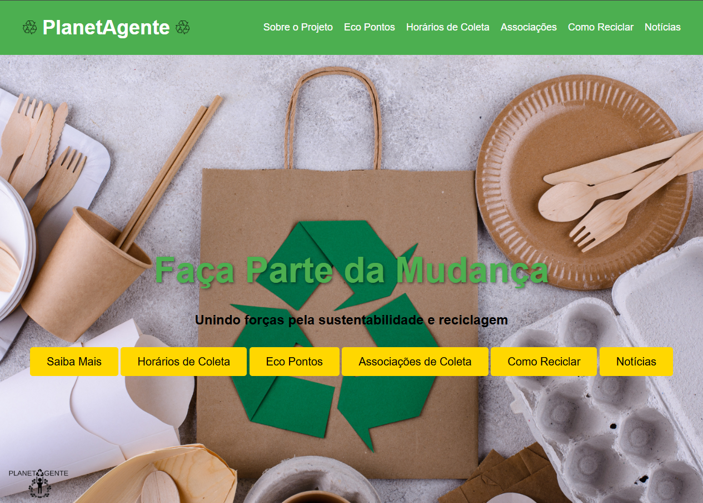
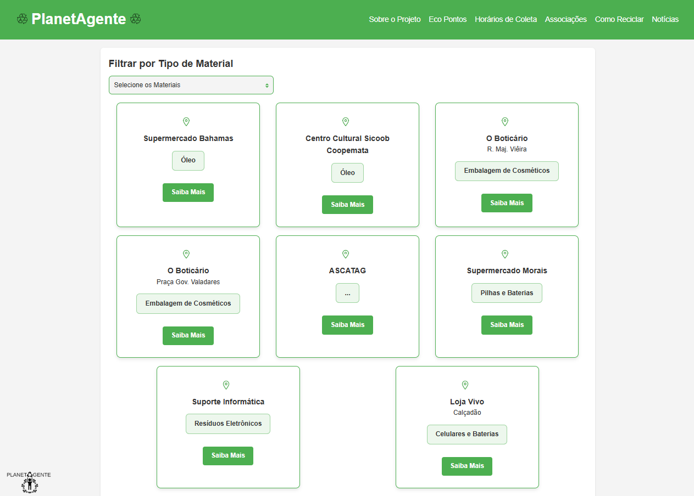
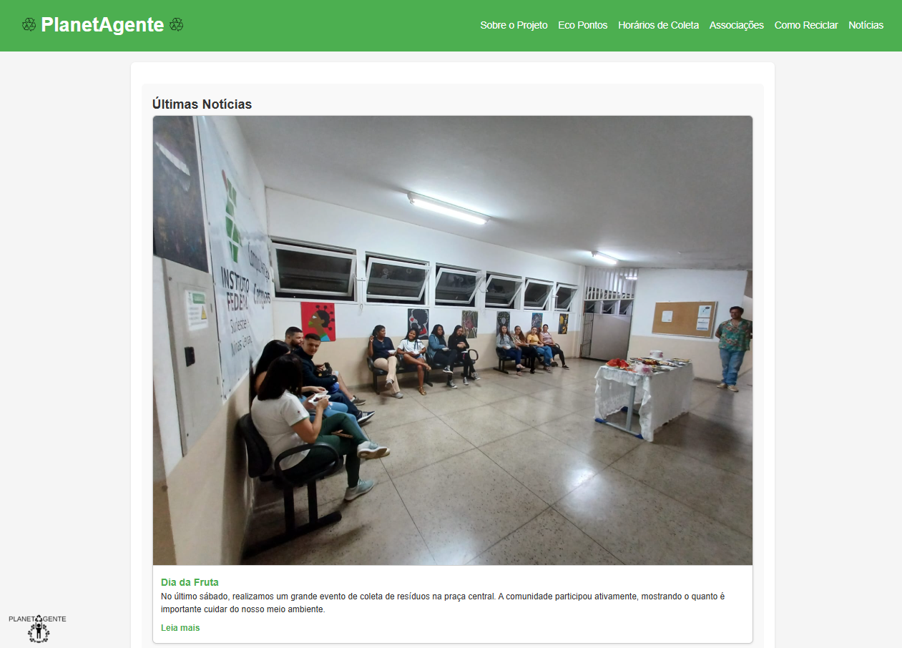

# 🌎 PlanetAgente

O **Planeta Agente** é um projeto de extensão voltado para **sustentabilidade, reciclagem e conscientização ambiental**, criado para informar, educar e conectar a comunidade com iniciativas de coleta seletiva e reutilização de materiais.

## 📖 Sobre o Projeto
O site serve como um **ponto central de informações** sobre:
- ♻️ Eco Pontos da cidade e materiais aceitos
- 📍 Endereços e localização via Google Maps
- 📰 Notícias, eventos e atualizações
- 🤝 Associações de coleta e parceiros
- 🌱 Conteúdo educativo sobre reciclagem e meio ambiente

## 🖼 Demonstrações

### Página de Eco Pontos

### Página de Notícias

---

## 🛠 Tecnologias Utilizadas
- **HTML5** – Estrutura das páginas
- **CSS3** – Estilo visual e responsividade
- **JavaScript** – Interatividade e funcionalidades
- **Google Maps** – Exibição da localização dos Eco Pontos

---

## 📂 Estrutura do Site
- **Home** – Apresentação do projeto
- **Eco Pontos** – Informações detalhadas de cada ponto de coleta
- **Notícias** – Atualizações e eventos
- **Associações** – Parceiros e entidades ligadas à reciclagem
- **Conteúdo Educativo** – Explicações sobre reciclagem e sustentabilidade

---

## 🎯 Objetivo
Promover a **reciclagem**, **reduzir o impacto ambiental** e criar uma rede de apoio entre população, empresas e instituições comprometidas com um planeta mais limpo e sustentável.

---

## 📌 Observações
- Layout intuitivo e adaptável a diferentes dispositivos.
- Paleta de cores e identidade visual unificada em todo o site.
- Estrutura otimizada para fácil navegação.

---

## 📜 Licença
Projeto desenvolvido como parte de um **projeto de extensão acadêmico**.  
Uso livre para fins **educacionais e não comerciais**.

---

🔗 **Acesse o site:** [PlanetAgente](https://planetagente-ifsudestemg-cataguases.netlify.app/)
